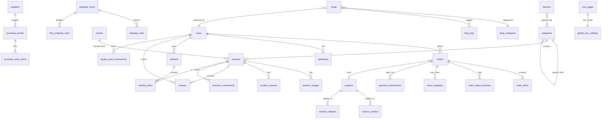

# Database ER Diagram

## Core Tables (40+)

- **Catalog**: `categories`, `brands`, `products`, `product_images`, `product_variants`
- **Commerce**: `orders`, `order_items`, `order_status_histories`, `return_requests`, `coupons`, `coupon_product`, `coupon_category`
- **Customers**: `users`, `addresses`, `wishlists`, `wishlist_items`, `compare_products`, `recently_viewed_products`
- **Inventory**: `suppliers`, `purchase_entries`, `purchase_entry_items`, `inventory_movements`
- **Shipping**: `shipping_zones`, `shipping_rates`, `free_shipping_rules`
- **Payments**: `payment_transactions`
- **Content**: `cms_pages`, `blogs`, `blog_categories`, `blog_tags`, `banners`, `reviews`
- **Marketing**: `newsletter_subscribers`, `email_campaigns`, `abandoned_carts`, `loyalty_point_transactions`, `referrals`
- **i18n**: `languages`, `currencies`
- **SEO**: `global_seo_settings` (+ per-entity SEO columns)
- **System**: Spatie `roles`, `permissions`, `activity_log`, `login_logs`
