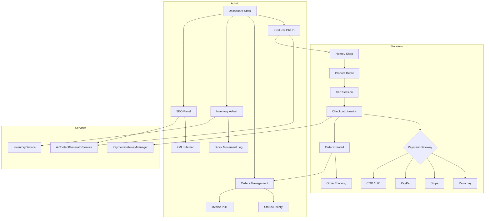
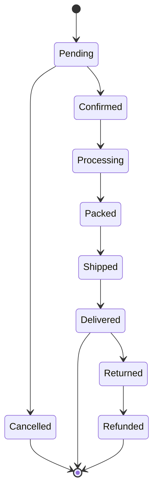

# Module Flow Diagram

## Order Lifecycle

## Route Structure

| Prefix | File | Purpose |
|--------|------|---------|
| `/` | `web.php` | Storefront Livewire pages |
| `/admin` | `admin.php` | Admin panel (auth + admin middleware) |
| `/api/v1` | `api.php` | REST API (Sanctum) |
